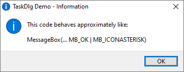

# Wrapper for Win32 TaskDialog



```c
static void demo_info(void)
{
    TASKDLG_SPEC_t s = { 0 };
    s.mainIcon.type = TASKDLG_ICON_INFO;
    s.cancelable = TRUE;
    s.commbtnOk = TRUE;
    s.szTitle = L"TaskDlg Demo - Information";
    s.szText = L"This code behaves approximately like:\n\n"
        L"MessageBox(... MB_OK | MB_ICONASTERISK)";
    TaskDlg_ShowDialog(&s);
}
```

* Easy to use
* Very friendly for C code
* Compatible with old Windows SDK
